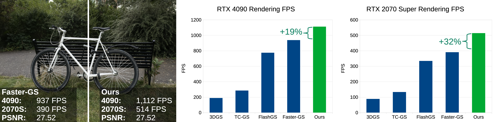

3DGS rendering FPS comparison across several methods demonstrating that, compared to Faster-GS, our method is up to 19% faster on the RTX 4090 and 32% faster on the 2070 Super while producing the exact same image.

## Abstract
3D Gaussian Splatting (3DGS) is the de facto standard for capturing and rendering radiance fields in real time
and has seen widespread adoption across a wide range of applications. Several recent methods have been
proposed for improving rendering speed; however, these solutions often reduce model resolution, rely on
approximations that degrade image quality, or require special hardware. We carefully analyze the performance
of the standard CUDA-based pipeline used for rendering, focusing on overall memory transfer, synchronization
bottlenecks, and computation load. Based on this analysis, we present three optimizations to 3DGS’s alpha
blending stage that improve rendering performance without changing the rendered output. First, we use
warp-level collaboration to subdivide an image tile and efficiently cull splats that have no geometric overlap
with pixels, avoiding expensive alpha evaluation. Second, we choose render batch sizes that better optimize
compute and memory load in the kernel. And third, we rearrange splatting data to make it easier to move
through shared memory. Our algorithm modifications can be directly applied to the standard CUDA-based
pipeline, making it easy to add to future implementations. We evaluate our method against other modern
implementations to illustrate the computation gains achieved by our contributions.

See the implementation in our [fork of Faster-GS](https://github.com/PLSE-Splats/faster-gaussian-splatting/tree/warp-cull-bigger-fetch).

## Contact

Kenneth J. Yang: kjy5@uw.edu
